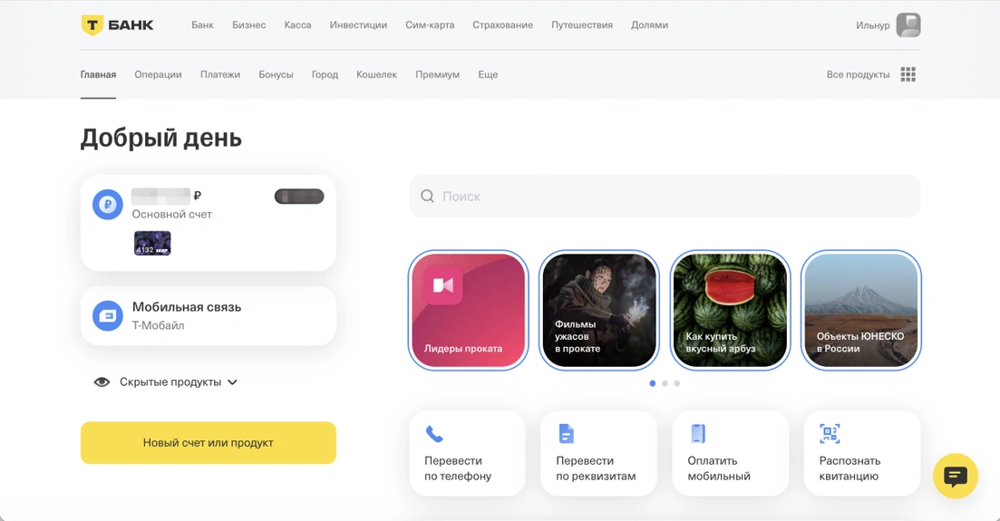
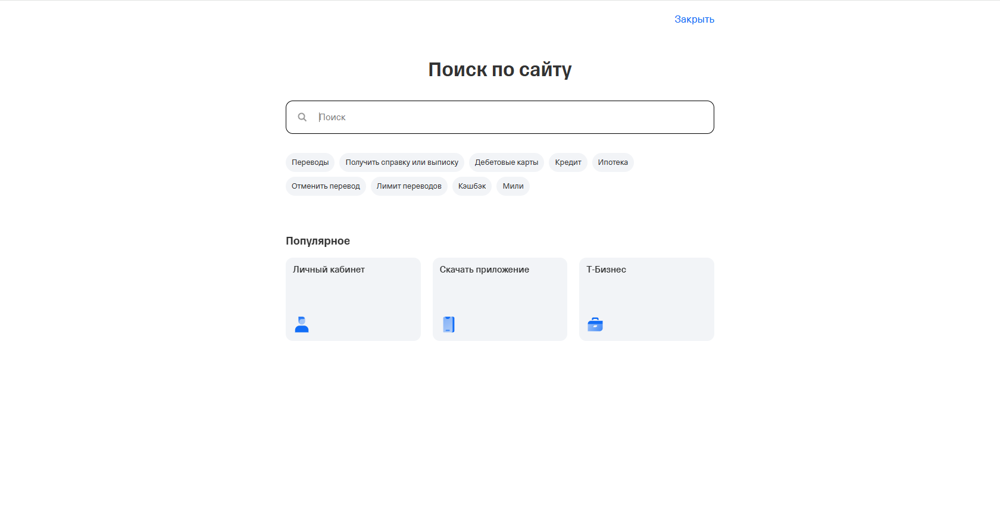
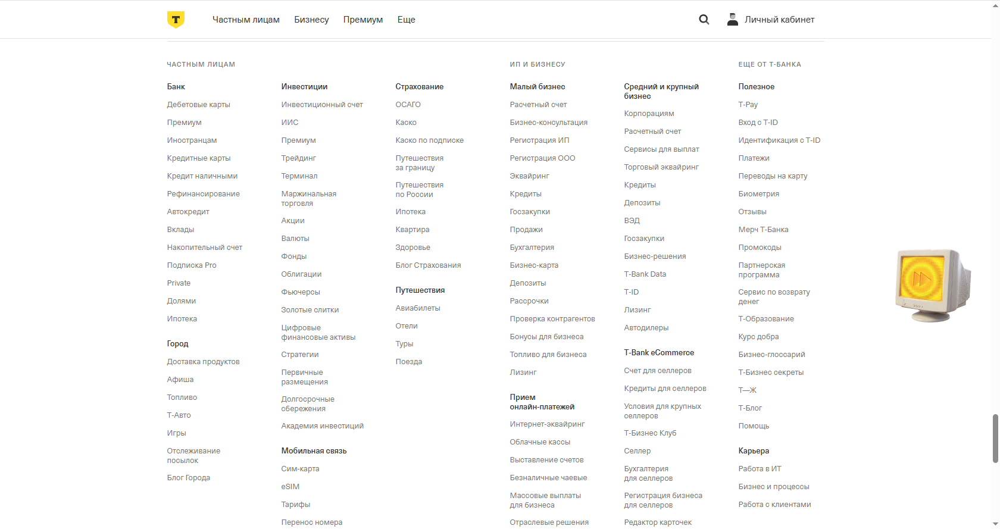
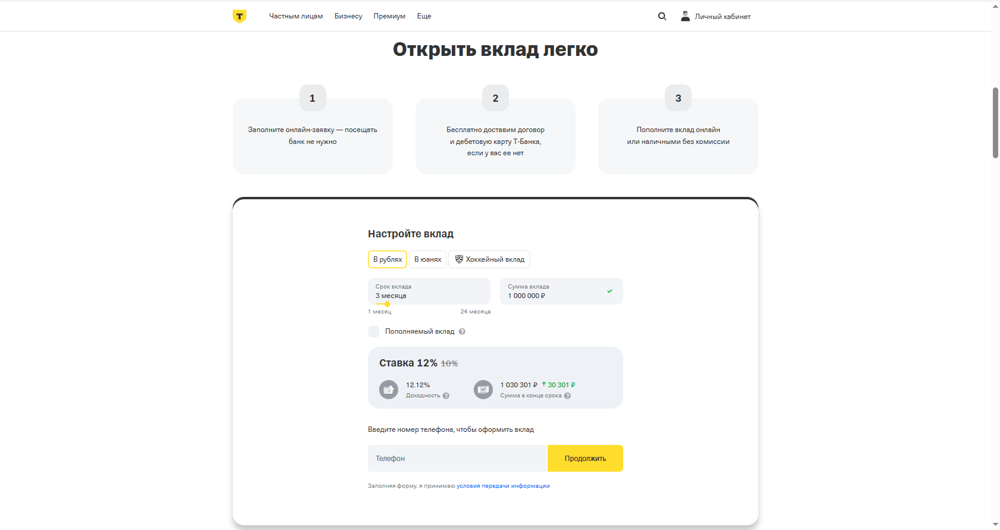
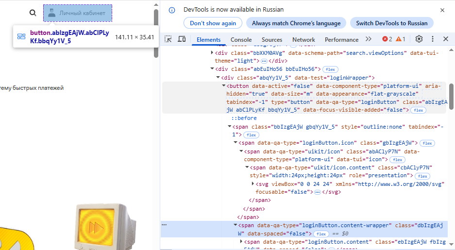
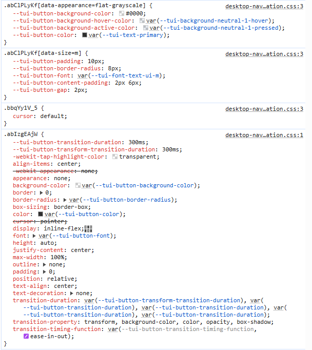
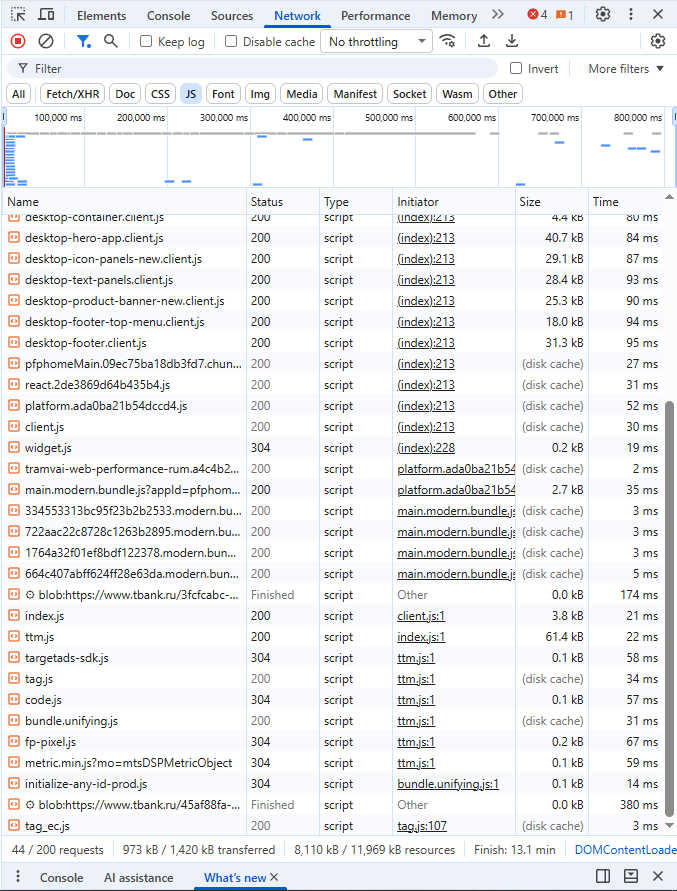
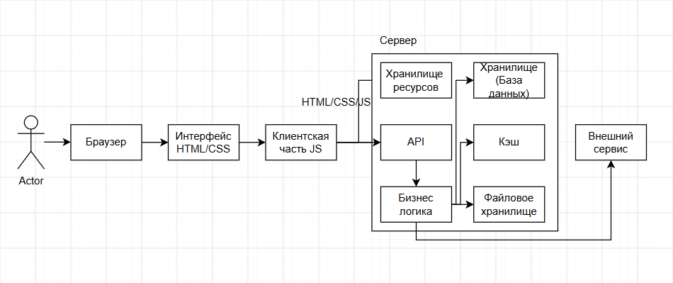
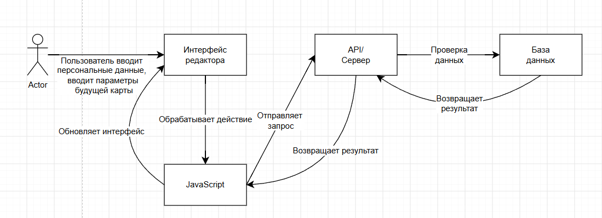
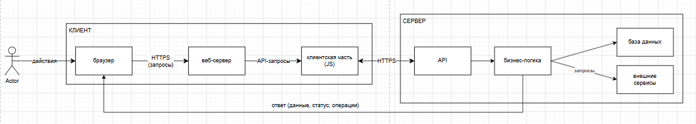

# Анализ информационной системы
## 1. Описание системы

Название: Т-Банк

Ссылка: https://www.tbank.ru/

Назначение: 
 Предоставление широкого спктра финансовых и нефинансовых услуг дистанционно, без привязки к физическим отделениям.

Целевая аудитория:
 - физические лица
 - юридические лица
 - сотрудники банка
 - партнеры и получатели

Основные возможности:
 - управление счетами 
 - переводы другим людям
 - платежи (мобильная связь, интернет, оплата ЖКХ)
 - инвестиции (покупк акций, облигаций)
 - кредиты (оформление)
 - экосистема (интеграции с сервисами)
 - эквайринг 
 - онлайн-бухгалтерия
 - открытие и ведение расчетных счетов
 - открытие вкладов и накопительных счетов
 - оформление страхования
 - мобильная связь

Выбранный сценарий:
Открытие накопительного счета.

В рамках сценария пользователь заполняет все нужные данные и открывает накопительный счет.

## 2. Анализ пользовательского интерфейса
### 2.1. Основные принципы и разделы

В рамках лабораторной работы исследуется информационная система Т-Банк - онлайн банк.

В системе используются следущие основные страницы и разделы:
 - главная страница Т-Банк
 - страница авторизации
 - личный кабинет пользователя
 - страница поиска
 - каталог продуктов и услуг
 - страница управления счетами, картами, вкладами

Часть разделов доступны только после авторизации пользователя.

### 2.2. Ключевые элементы интерфейса

| Элемент интерфейса     | Назначение                                                            |
|------------------------|-----------------------------------------------------------------------|
| Логотип Т-Банк         | Переход на главную страну или в личный кабинет                        |
| Главное меню           | Навигация между основными разделами                                   |
| Личный кабинет         | Управление настройками, данными                                       |
| Список карт и счетов   | Просмотр баланса, выбор активной карты для операции                   |
| История операций       | Просмотр всех транзакций, фильтрация по категориям                    |
| Кнопка перевода        | Быстрый переход к переводу денег по номеру телефона или реквизитам    |
| Библиотека шаблонов    | Список сохраненных получателей и регулярных платежей                  |
| Категории кэшбека      | Выбор категорий для повышенного вознаграждения                        |
| Карточка продукта      | Предварительный просмотр условий вклада, кредита или страховки        |
| Чат с поддержкой       | Общение с сотрудником банка для решения вопроса                       |
| Панель настроек        | Изменене лимитов, блокировка карт, настройка уведомлений              |
| Кнопка "Оформить"      | Заказ нового продукта (карты, вклада, кредита)                        |
| Раздел "Сферы"         | Объединение сервисов по жизненным категориям: Дом, Авто, Путешествия  |

### 2.3. Выполнение пользовательского сценария

Выбранный сценарий: 
Оформление вклада

Последовательность действий:
1. Открыть сайт Т-Банка
2. Выполнит авторизация в личном кабинете
3. Перейти в раздел "Накопления" или "Сбережения"
4. Выбрать продукт "Вклад"
5. Определить срок вклада (от 1 до 24 мес)
6. Установить тип вклада (пополняемый или нет)
7. Выбрать способ начисления процентов 
8. Проверить итоговую ставку и расчет дохода
9. Нажать кнопку "Открыть вклад"
10. Подтвердить открытие кодом из СМС
11. Пополнить вклад с карты

В результате выполнения сценария пользователь смог открыть вклад.

### 2.4. Компоненты, участвующие в сценарии
 
| Компонент интерфейса       | Назначение                                                 | Этап  |
|----------------------------|------------------------------------------------------------|-------|
| Форма авторизации          | Позволяет пользователю войти в личный кабинет              | 2     |
| Личный кабинет             | Предоставляет доступ к управлению финансами пользователя   | 3     |
| Раздел "Накопления"        | Отображает доступные продукты для сбережений               | 4     |
| Карточка продукта "Вклад"  | Показывает условия, ставки и позволяет выбрать тип вклада  | 5     |
| Калькулятор вклада         | Позволяет задать срок, сумму и увидеть расчет дохода       | 6-8   |
| Кнопка "Открыть вклад"     | Запускает процесс оформления вклада                        | 9     |
| Форма подтверждения        | Подтверждает операцию кодом                                | 10    |
| Кнопка перевода            | Позволяет внести сумму на вклад                            | 11    |

### 2.5. Скриншоты

#### Скриншот 1. Личный кабинет Т-Банка

На скриншоте показан личный кабинет пользователя.

#### Скриншот 2. Поисковая система Т-Банка

На скриншоте показана поисковая система Т-Банка.

#### Скриншот 3. Каталог продуктов и услуг

На скриншоте показан главная страница сайта Т-Банка с каталог всех продуктов и услуг.

#### Скриншот 4. Вклад

На скриншоте показана страница, где оформляется вклад (пример предоставления услуги)

### 2.6. Выводы

В ходе анализа пользовательского интерфейса Т-Банка бали определены основные страницы системыи ключевые элементы.

Выбранный сценарий состоит из следующих основных этапов:
 - перехол в личный кабинет
 - выбор продукта "Вклад"
 - выбор параметров 
 - заполнение данных
 - подтверждение операции
 - перевод суммы

## 3. Анализ клиентской части
### 3.1. Исследование HTML-структуры

Для анализа выбран элемент главной страницы "Личный кабинет" на сайте Т-Банка.
Элемент используется для перехода в личный кабинет и авторизации пользователя.

Основные характеристики элемента:
 - HTML-тег: <button data-active="false" data-component-type="platform-ui" aria-hidden="true" data-size="m" data-appearance="flat-grayscale" tabindex="-1" type="button" data-qa-type="loginButton" class="abIzgEAjW abClPLyKf bbqYy1V_5" data-focus-visible-added="false"><svg viewBox="0 0 24 24" xmlns="http://www.w3.org/2000/svg" focusable="false"><defs><linearGradient id=":R2mpgeq:0_linear_1525_526" x1="10.5" y1="1" x2="10.5" y2="10.608" gradientUnits="userSpaceOnUse"><stop stop-color="currentColor"></stop><stop offset="1" stop-opacity=".5" stop-color="currentColor"></stop></linearGradient></defs><path d="M3 19a6 6 0 0 1 6-6h6a6 6 0 0 1 6 6v3H3v-3Z" fill="currentColor"></path><path opacity=".35" fill-rule="evenodd" clip-rule="evenodd" d="M16.223 2.952a2.454 2.454 0 0 1-2.177 1.32H11.59a2.455 2.455 0 0 0-2.454 2.455v3.88A4.5 4.5 0 0 0 16.5 7.137V4.273c0-.47-.1-.917-.278-1.32Z" fill="currentColor"></path><path fill-rule="evenodd" clip-rule="evenodd" d="M16.223 2.952A3.274 3.274 0 0 0 13.227 1H7.5v6.136a4.49 4.49 0 0 0 1.636 3.472v-3.88a2.455 2.455 0 0 1 2.455-2.455h2.455c.946 0 1.767-.536 2.177-1.32Z" fill="url(#:R2mpgeq:0_linear_1525_526)"></path></svg>
Личный кабинет
</button>
 - CSS-классы: "abIzgEAjW abClPLyKf bbqYy1V_5", "bbIzgEAjW gbqYy1V_5", "gbIzgEAjW", "abAClyP7N", "cbAClyP7N", "dbIzgEAjW", "ebIzgEAjW fbIzgEAjW", "hbqYy1V_5", отвечающих за оформление и поведение элемента
 - Текст элемента: "Личный кабинет"
 - Вложенные элементы: текст "Личный кабинет" и иконка в формате svg

Скриншот HTML-структуры:

### 3.2. Исследование CSS

Для выбранного элемента были обнаружены CSS-классы, определяющие его вид и положение 

| Свойство         | Назначение                                              |
|------------------|---------------------------------------------------------|
| "color"          | Определяет цвет                                         |
| "font"           | Определяет размер текста                                |
| "padding"        | Задает внутренние отступы                               |
| "border-radius"  | Задает скругление углов                                 |
| "gap"            | Задает расстояние между иконкой и текстом               |
| "align-items"    | Выравнивает иконку и текст по центру по вертикали       |
| "display"        | Определяет способ отображения элемента                  |
| "height"         | Задает высоту области содержимого элемента              |
| "outline"        | Задает контур                                           |
| "position"       | Указывает способ позиционирования элемента на странице  |
| "max-width"      | Задает максимальную ширину элемента                     |

Скриншот CSS-стилей:

### 3.3. Исследование JavaScript

JavaScript используется для реализации интерактивного поведения сайта.

В разделе **Network** были обнаружены JavaScript-файлы, загружаемые вместе со страницей.

JavaScript отвечает, в частности, за:
 - обработку нажатий пользователя
 - открытие и закрытие элементов интерфейса
 - изменение содержимого страницы
 - взаимодействие с сервером
 - обновление интерфейса без полной перезагрузки страницы

При нажатии кнопки "Личный кабинет" интерфейс реагиует на действие пользователя и открывает страницу личного кабинета.

Скриншот загруженных JavaScript-файлов:

### 3.4. Загруженные ресурсы

При открытии сайта браузер загружает различныересурсы, необходимые для работы.

Были обнаружены следующие типы ресурсов:

| Тип         | Примеры            | Назначение                         |
|-------------|--------------------|------------------------------------|
| Document    | HTML-страница      | Загрузка страницы                  |
| Script      | JavaScript-файлы   | Работа клиентской логики           |
| Stylesheet  | CSS-файлы          | Оформление интерфейса              |
| Image       | Изображения        | Отображение графических элементов  |
| Font        | Шрифты             | Отображение текста                 |
| Fetch/XHR   | Запросы к серверу  | Обмен данными                      |

### 3.5. Анализ сетевых запросов

При открытии сайта браузер выполняет большое количеств сетевых запросов.

Они используются для загрузки элементов интерфейса, JavaScript, CSS, изображений, а также для обмена данными с сервером и сбора аналитики.

| Метод                                                                       | Тип       | Статус  |Назначение                                                  |
|-----------------------------------------------------------------------------|-----------|---------|------------------------------------------------------------|
| GET  https://cdn.tbank.ru/s3aas/apps/pwaplatform/prod/compiled/platform.js  | Script    | 200     | Загрузка основного JavaScript-кода платформы               |
| GET  https://tcb.cdn-tinkoff.ru/online/61754796/online_chunk_103.js         | Script    | 200     | Загрузка фрагмента кода клиентской части                   |
| POST https://api-statist.tinkoff.ru/gateway/v1/events                       | Fetch/XHR | 204     | Обмен данными с сервером (отправка аналитических событий)  |
| GET  https://top-fwz1.mail.ru/tracker                                       | Image     | 200     | Сбор аналитики через пиксель-трекер                        |

### 3.6. Вывод

В ходе анализа клиентской части Т-Банка были изучены:
 - HTML-структура элемента интерфейса
 - CSS-классы и основные стили
 - JavaScript-файлы и их роль в работе интерфейса
 - загружаемые ресурсы
 - сетевые запросы браузера

Установлено, что клиентская часть отвечает за обработку действий пользователся и взаимодействие с сервером.

При нажатии кнопки "Личный кабинет" пользователь выполняет действие, JavaScript обрабатывает это действие, а клиентская часть при необходимости выполняет сетевые запросы для получения и сохранения данных.

## 4. Анализ серверной части и API
### 4.1. Серверная часть

Серверная часть Т-Банка отвечает за операции, которые требуют обработки и хранения данных на сервере.

В рамках выбранного сценария "Оформление вклада" можно предположить выполнение следующих серверных операций:
 - получение данных страницы
 - сохранение изменений страницы
 - загрузка и получение необходимых данных
 - получение данных профиля пользователя
 - получение статуса обработки заявки
 - отправка персональных данных пользователя для одобрения

Точная внутренняя реализация серверной части недоступна пользователю, поэтому часть выводов основана на наблюдемых сетевых запросах и поведении системы.

### 4.2. Передаваемые данные

При работе сайта между браузеров и сервером передаются различные данные.

В зависимости от выбранного действия это могут быть:
 - идентификатор выбранного банковского продукта
 - персональные данные клиента
 - параметры заявки
 - параметры для расчета
 - код подтверждения

Например, при отправке формы заявки на карту клиентская часть должна передать серверу информацию, необходимую для идентификации пользователя, проверки его кредитоспособности и создания заявки в системе банка.

### 4.3. API и сетевое взаимодействие

В разделе Network бали онаружены запросы типа "Fetch/XHR"

Они используются клиентской частью для обмена данными с сервером.

| Параметр    | Значение                                                                                    |
|-------------|---------------------------------------------------------------------------------------------|
| Метод       | POST                                                                                        | 
| Тип         | Fetch/XHR                                                                                   | 
| URL         | /api/statist/gateway/v1/events                                                              | 
| Статус      | 200 OK                                                                                      | 
| Назначение  | Сбор данных о поведении пользователей на сайте и отправка их в аналитическую систему банка  | 

API позволяет клиентскоц части отправлять данныена сервер и получать результат обработки.

Скриншот сетевого запроса:

### 4.4. Внешние сервисы

При работе сайта браузер может обращаться не только к основному домену системы, но и к другим доменам.

Такие обращения могут использоваться ддя:
 - загрузка шрифтов
 - загрузка изображений
 - аналитики
 - работа внешних интеграций
 - других дополнительных функций

В ходе анализа были обнаружены следующие внешние домены:

| Домен                | Назначение                   |
|----------------------|------------------------------|
| t-static.ru          | Домен статистических файлов  |
| nspk.ru              | Для работы СБП               |
| tinkoffinsurance.ru  | Страховые сервисы            |

### 4.5. Хранилища данных

Внутренние хранилища Т-Банка из браузера не видны.

Но по функциям системы можно предположить наличие нескольких типов хранилищ:

| Хранилище            | Предполагаемое назначение                                      |
|----------------------|----------------------------------------------------------------|
| База данных          | Хранение пользователей, страниц и настроек                     |
| Кэш                  | Быстрый доступ к часто используемым данным                     |
| Браузерное хранилище | Хранение части данных непосредственно на стороне пользователя  |
| Файловое хранилище   | Хранение загруженных документов                                |

Эти предположения основаны на функциональности системы.

### 4.6. Общая схема взаимодействия

На основании проведенного анализа можно представить в виде упрощенный схемы работы системы:

## 5. Описание пользовательского сценария
### 5.1 Выбранный сценарий

Название сценария: оформление заявки на дебетовую карту.

Цель сценария: заполнить и отправить форму заявки на выпуск новой карты, после чего получить решение банка.

### 5.2. Последовательность выполнения 

#### Этап 1. Пользователь открывает страницу оформления

Пользователь авторизуется в личном кабинете или на сайте, выбирает нужный продукт и переходит на страницу оформления карты.

На этом этапе браузер загружает интерфейс (HTML/CSS/JS), а также данные о доступных карточных продуктах через API-метод POST /api/v1/cards/list

#### Этап 2. Пользователь заполняет форму заявки

Пользователь вводит свои персональные данные, указывает желаемый лимит или другие параметры будущей карты.

JavaScript-код проверяет заполнение полей на стороне клиента и подготавливает данные к отправке на сервер.

#### Этап 3. Клиентская часть отправляет запрос

Клиентская часть JS формирует запрос к API и отправляет его через HTTP-метод POST по адресу /api/v1/cards/apply.

В запросе передаются данные о клиенте, выбранном продукте и параметрах карты.

#### Этап 4. API принимает запрос

Запрос попадает в API Gateway — платформу управления внутренними API, которая проверяет права доступа, лимиты запросов и передаёт запрос в соответствующий сервис.

#### Этап 5. Сервер обрабатывает запрос

Сервер выполняет проверку данных и обращается к бизнес-логике для принятия решения по заявке.

Предположительно, система проверяет кредитную историю и другие параметры в базе данных, а также использует NoSQL-базы данных  для высокодоступной обработки большого количества запросов.

#### Этап 6. Сервер возвращает результат

После обработки сервер возвращает ответ клиентской части.

Ответ может содержать статус заявки, одобренный лимит и дополнительные условия.

#### Этап 7. Интерфейс отображает результат

JavaScript обрабатывает полученный результат и обновляет интерфейс.

Пользователь видит статус заявки в рабочей области. В случае положительного решения ему может быть предложено продолжить оформление или перейти к выпуску виртуальной карты.

### 5.3. Общая последовательность

Упрощенно сецнарий можно представить следующим образом:

## 6. Построение архитектурной схемы
### 6.1. Взаимодействия компонентов

Основные взаимодействия в системе:

1. Пользователь выполняет действия в интерфейсе Т-Банка.
2. Браузер отображает интерфейс и выполняет клиентский код.
3. Клиентская часть обрабатывает действия пользователя.
4. При необходимости клиентская часть отправляет запрос через API.
5. Сервер обрабатывает полученный запрос.
6. Сервер обращается к хранилищу данных.
7. Сервер возвращает результат клиентской части.
8. Клиентская часть обновляет интерфейс.
9. Пользователь видит результат выполненного действия.

### 6.2. Архитектурная схема

